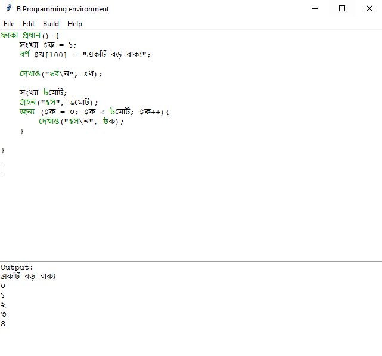

# Bangla Programming language (B)

An interpreted programming language to code with bangla language. Comes with its own IDE and use gcc compiler to compile. Written in python.

## Requirement
- python 3.5+
- gcc compiler

## How to run the IDE
`python ide.py`

## how to compile and run code
- Compile  
    build ---> compile
- Run  
    build ---> run  
    (the output will be show in the output window below)

## Warning
note that the highlighting functionality does not work automatically yet. For that you have to do manually edit ---> highlight

## Language specification
The language is mainly designed with all the syntax similar to C programming language.
Some key difference are
1. All variable name must start with $ sign (৳)

## Keywords (compared with C)
প্রধান  --->   main  
দেখাও  --->  printf  
গ্রহন ---> scanf 
ফাকা --->  void 
দশমিক ---> double 
সংখ্যা --->  int 
বর্ণ  --->  char 
যতখন --->  while 
কর --->  do 
জন্য --->  for 
যদি --->  if 
থাম --->  break 
%ব  --->  %s 
%স  --->  %d 
%দ  --->  %lf 
%চ  --->  %c 
\ন  --->  \\n 
